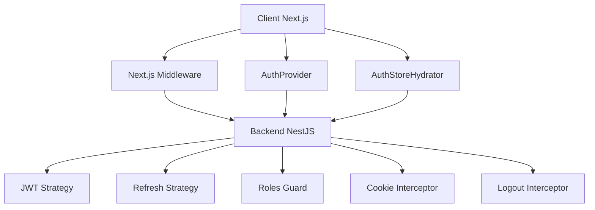
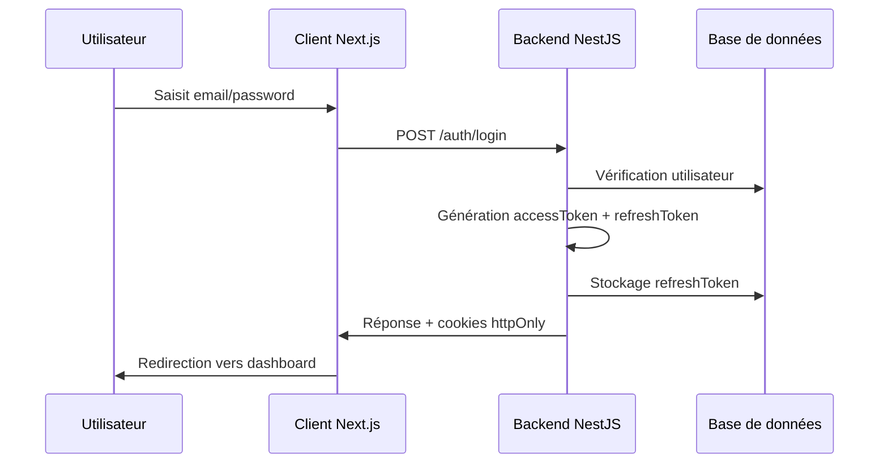
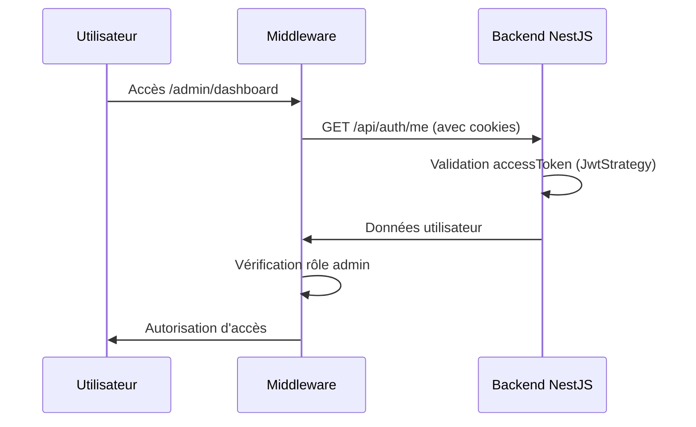
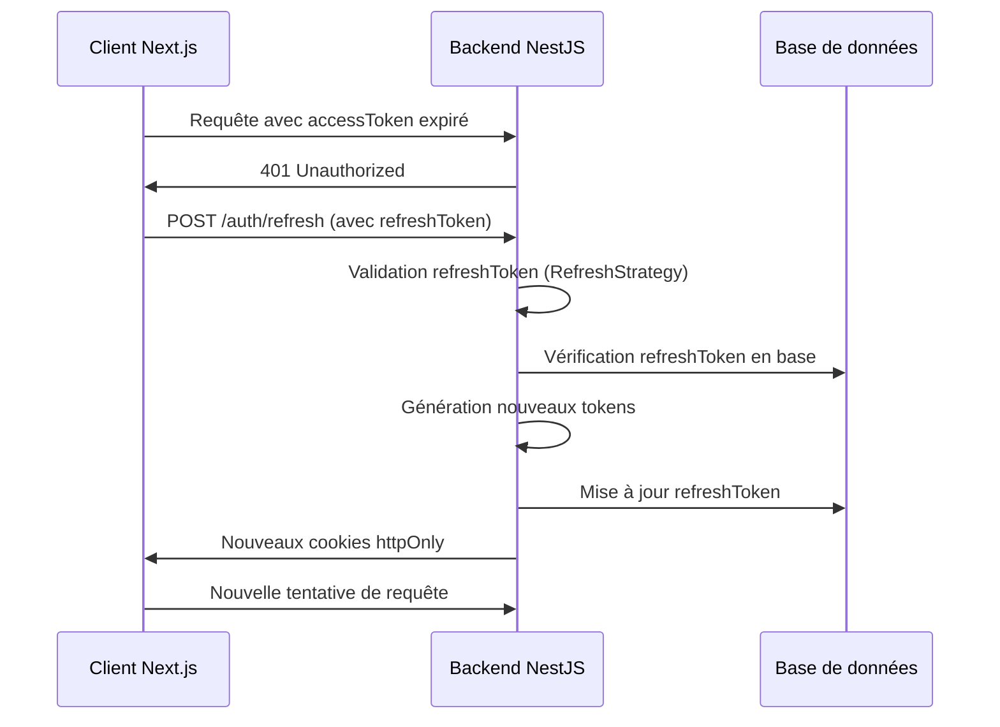
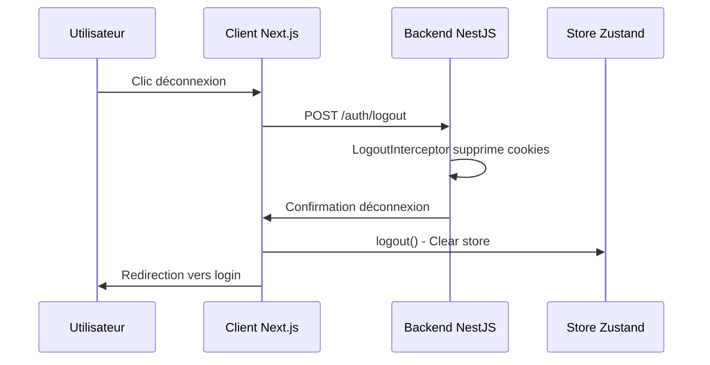
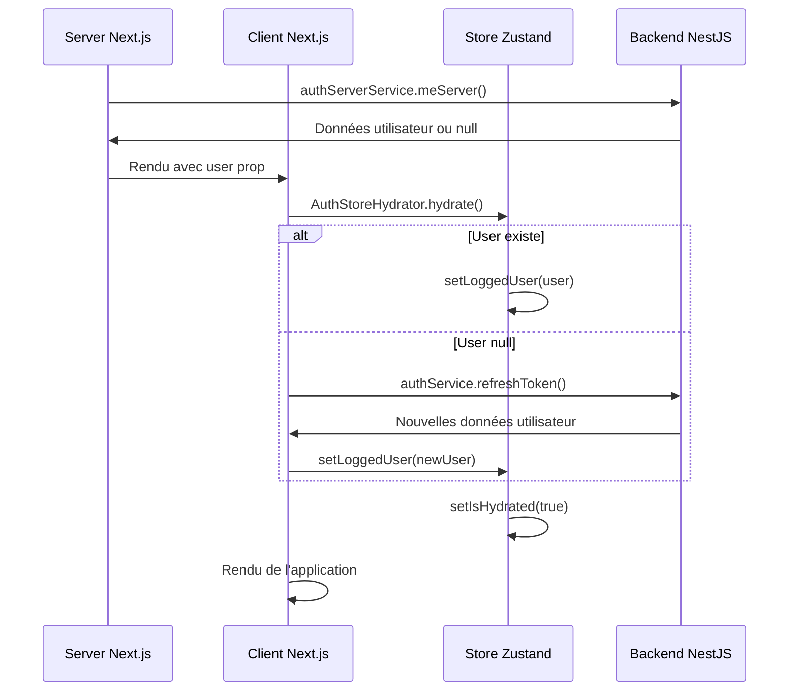

# 🔐 Architecture d'Authentification - Pets Adoption

## 📋 Vue d'ensemble

Cette application utilise une architecture d'authentification moderne et sécurisée basée sur des **cookies httpOnly** avec des tokens JWT. L'architecture combine un backend NestJS et un frontend Next.js pour offrir une expérience utilisateur fluide et sécurisée.

## 🏗️ Architecture Générale



---

## 🔧 Backend NestJS - Security Road

### 1️⃣ **Strategies (Passport)**

#### **JWT Strategy** 
- **Rôle** : Valide l'`accessToken` depuis les cookies
- **Extraction** : `request?.cookies?.accessToken`
- **Validation** : Retourne `{ id, email, role }` si token valide
- **Secret** : `JWT_SECRET`

#### **Refresh Strategy**
- **Rôle** : Valide le `refreshToken` et vérifie la correspondance en base
- **Extraction** : `request?.cookies?.refreshToken`
- **Sécurité** : Utilise `timingSafeEqual()` contre les attaques timing
- **Validation** : Compare le token reçu avec celui stocké en base
- **Secret** : `JWT_REFRESH_SECRET`

### 2️⃣ **Guards (Protection des routes)**

| Guard | Usage | Protection |
|-------|-------|------------|
| `JwtAuthGuard` | Routes authentifiées | Vérifie l'accessToken |
| `RefreshGuard` | Endpoint `/refresh` | Vérifie le refreshToken |
| `RolesGuard` | Routes avec rôles | Vérifie les permissions utilisateur |

### 3️⃣ **Services**

#### **Auth Service**
- `generateTokensForUser()` : Crée accessToken (15m) + refreshToken (7d)
- `login()` : Authentifie et génère les tokens
- `refreshToken()` : Renouvelle les tokens
- `logout()` : Supprime les cookies et déconnecte l'utilisateur
- **Stockage** : RefreshToken sauvé en base de données

### 4️⃣ **Interceptors**

#### **Cookie Interceptor**
- **Usage** : Appliqué sur `/login` et `/refresh`
- **Fonction** : Transforme les tokens JWT en cookies httpOnly sécurisés
- **Configuration** : `httpOnly: true`, `secure: prod`, `sameSite: 'lax'`
- **Nettoyage** : Supprime les tokens de la réponse JSON

#### **Logout Interceptor**
- **Usage** : Appliqué sur `/logout`
- **Fonction** : Supprime les cookies en les définissant avec `maxAge: 0`
- **Sécurité** : Nettoie complètement les tokens côté client

### 5️⃣ **Endpoints**

| Endpoint | Method | Guard | Interceptor | Description |
|----------|--------|-------|-------------|-------------|
| `/auth/login` | POST | - | Cookie | Authentification avec email/password |
| `/auth/refresh` | POST | Refresh | Cookie | Renouvellement des tokens |
| `/auth/me` | GET | JWT | - | Récupération des infos utilisateur |
| `/auth/logout` | POST | - | Logout | Déconnexion et suppression cookies |

---

## 🌐 Frontend Next.js

### 1️⃣ **Middleware Next.js**

- **Cible** : Routes `/admin/*`
- **Fonction** : Appelle `/api/auth/me` avec les cookies de la requête
- **Vérifications** : 
  - Utilisateur authentifié
  - Rôle ADMIN ou SUPERADMIN
- **Redirections** : `/auth/login` ou `/` selon le cas

### 2️⃣ **Services**

#### **Auth Server Service** (SSR)
- **Usage** : Server Components Next.js
- **Méthode** : `meServer()` - Récupère l'utilisateur via cookies Next.js
- **Retour** : `AuthenticatedUser | null`

#### **Auth Service** (Client)
- **Usage** : Client Components
- **Méthodes** : `login()`, `refreshToken()`, `logout()`
- **Transport** : API client avec cookies automatiques

### 3️⃣ **Store Zustand**

```typescript
interface AuthState {
  loggedUser: AuthenticatedUser | null;
  isHydrated: boolean; // État d'hydratation
  setLoggedUser: (user: AuthenticatedUser | null) => void;
  setIsHydrated: (hydrated: boolean) => void;
  logout: () => void;
}
```

### 4️⃣ **Composants d'Authentification**

#### **Auth Store Hydrator**
- **Rôle** : Hydrate le store Zustand au démarrage
- **Logique** : 
  - Si `user` du serveur → `setLoggedUser(user)`
  - Sinon → Tentative `refreshToken()`
  - Toujours → `setIsHydrated(true)` à la fin

#### **Auth Provider**
- **Rôle** : Contrôle le rendu de l'application
- **Logique** : Affiche un loading tant que `!isHydrated`
- **Avantage** : Évite les flashs de contenu incorrect

### 5️⃣ **Layout Public**

```typescript
// Récupération côté serveur
const user = await authServerService.meServer();

// Hydratation côté client
<AuthStoreHydrator user={user} />
<PublicProviders>
  {children}
</PublicProviders>
```

---

## 🔄 Flux d'Authentification

### **1. Connexion (Login)**


### **2. Accès à une page protégée**


### **3. Refresh Token automatique**


### **4. Déconnexion (Logout)**


### **5. Hydratation côté client**


---

## 🔒 Sécurité

### **Mesures de sécurité implémentées :**

1. **Cookies httpOnly** : Les tokens ne sont pas accessibles via JavaScript
2. **Secure flag** : Cookies transmis uniquement en HTTPS (production)
3. **SameSite: 'lax'** : Protection contre les attaques CSRF
4. **timingSafeEqual** : Protection contre les attaques timing sur les refresh tokens
5. **Validation côté serveur** : Toutes les routes protégées vérifient les permissions
6. **Middleware Next.js** : Vérification avant le rendu des pages
7. **Rotation des tokens** : Nouveaux tokens générés à chaque refresh
8. **Stockage sécurisé** : Refresh tokens hachés en base de données

### **Variables d'environnement requises :**
```env
# JWT Configuration
JWT_SECRET=your-super-secret-jwt-key
JWT_EXPIRES_IN=15m
JWT_REFRESH_SECRET=your-super-secret-refresh-key
JWT_REFRESH_EXPIRES_IN=7d

# Database
DATABASE_URL=your-database-url

# Environment
NODE_ENV=production
```

---

## 🚀 Avantages de cette architecture

1. **Sécurité maximale** : Cookies httpOnly + validation serveur
2. **UX fluide** : Pas de flash de contenu non authentifié
3. **Performance** : Hydratation optimisée, pas d'appels redondants
4. **Maintenabilité** : Code organisé et séparation des responsabilités
5. **Scalabilité** : Architecture modulaire et extensible
6. **SSR-friendly** : Compatible avec le rendu côté serveur Next.js

Cette architecture offre une solution d'authentification robuste, sécurisée et performante pour une application moderne Next.js + NestJS.
